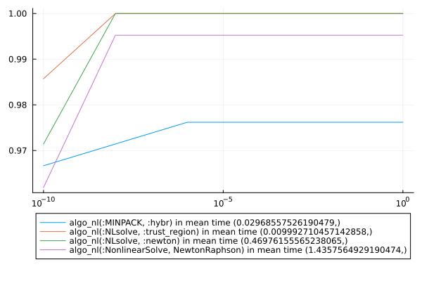

# Benchmarks for bench_all.jl

```julia
using Pkg
using CTProblems
using MINPACK
using NLsolve
using BenchmarkTools
using CTFlows
using MLStyle
using MacroTools
using LinearAlgebra
using Plots
using CTBase
using ProgressBars
using NonlinearSolve
using Sundials
using DataFrames
using CSV
using PrettyTables
include("bench_problems.jl")
include("bench_algo.jl")
algos = [algo_nl(:MINPACK, :hybr), algo_nl(:NLsolve, :newton), algo_nl(:NLsolve, :trust_region), algo_nl(:NonlinearSolve, NewtonRaphson())]
problem_list = [OCPProblem{(:exponential, :energy, :state_dim_1, :control_dim_1, :lagrange)}(); OCPProblem{(:exponential, :time, :state_dim_1, :control_dim_1, :lagrange)}(); OCPProblem{(:integrator, :energy, :free_final_time, :state_dim_1, :control_dim_1, :lagrange)}(); OCPProblem{(:turnpike, :integrator, :state_energy, :state_dim_1, :control_dim_1, :lagrange, :control_constraint, :singular_arc)}(); OCPProblem{(:integrator, :energy, :state_dim_2, :control_dim_1, :lagrange, :noconstraints)}(); OCPProblem{(:integrator, :energy, :distance, :state_dim_2, :control_dim_1, :bolza)}()]
ξ_list = Dict((pb => generate_variation(pb.sol, 3, 10) for pb = problem_list))
(rates_tol, times, df_rate) = compute_rate(algos, problem_list, ξ_list)
plot([10.0 ^ -i for i = 10:-2:0], [rates_tol[key] for key = collect(keys(rates_tol))], label = reshape([shorten_label(string(key)) * " in mean time " * string(times[key]) for key = collect(keys(rates_tol))], 1, size(algos, 1)))
plot!(xscale = :log10, yscale = :linear)
plot!(legend = :outerbottom)
savefig("build/bench_all.svg")
```
  
 ```julia 
CSV.write("build/df_rate_algo.csv", df_rate)
h1 = Highlighter(((df_rate, i, j)->begin
                j in [2, 3, 4, 5] && df_rate[i, j] == minimum(df_rate[:, j])
            end), bold = true, foreground = :red)
h2 = Highlighter(((df_rate, i, j)->begin
                j in [2, 3, 4, 5] && df_rate[i, j] == maximum(df_rate[:, j])
            end), bold = true, foreground = :green)
pretty_table(String, df_rate; tf = tf_markdown, alignment = :c, header = ["name"; [shorten_label(string(algo)) for algo = algos]], highlighters = (h1, h2))
```

|                               name                                | algo_nl(:MINPACK, :hybr) | algo_nl(:NLsolve, :newton) | algo_nl(:NLsolve, :trust_region) | algo_nl(:NonlinearSolve, NewtonRaphson) |
|-------------------------------------------------------------------|--------------------------|----------------------------|----------------------------------|-----------------------------------------|
|                  simple exponential - energy min                  |           1.0            |            1.0             |               1.0                |                   1.0                   |
|                   simple exponential - time min                   |           1.0            |            1.0             |               1.0                |                   1.0                   |
|             simple integrator - energy min - free tf              |           0.8            |            1.0             |               0.8                |                   1.0                   |
| simple nonsmooth turnpike - state energy min - affine system in u |           1.0            |            1.0             |               1.0                |                   1.0                   |
|             Double integrator energy - minimise ∫ u²              |           1.0            |            1.0             |               1.0                |                   1.0                   |
|      Double integrator energy/distance - minimise -x₁ + ∫ u²      |           1.0            |            1.0             |               1.0                |                   1.0                   |


