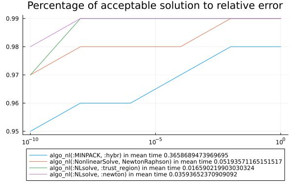

# Benchmarks for bench_easy.jl

```julia
using Pkg
using CTProblems
using MINPACK
using NLsolve
using BenchmarkTools
using CTFlows
using MLStyle
using MacroTools
using LinearAlgebra
using Plots
using CTBase
using ProgressBars
using NonlinearSolve
using Sundials
using DataFrames
using CSV
using PrettyTables
using ForwardDiff
include("bench_problems.jl")
include("bench_algo.jl")
algos = [algo_nl(:MINPACK, :hybr), algo_nl(:NLsolve, :newton), algo_nl(:NLsolve, :trust_region), algo_nl(:NonlinearSolve, NewtonRaphson())]
problem_list_easy = [OCPProblem{(:exponential, :energy, :x_dim_1, :u_dim_1, :lagrange)}(abstol = 1.0e-12, reltol = 1.0e-12); OCPProblem{(:exponential, :consumption, :x_dim_1, :u_dim_1, :lagrange, :non_diff_wrt_u)}(); OCPProblem{(:exponential, :time, :x_dim_1, :u_dim_1, :lagrange)}(); OCPProblem{(:integrator, :energy, :free_final_time, :x_dim_1, :u_dim_1, :lagrange)}(); OCPProblem{(:turnpike, :integrator, :state_energy, :x_dim_1, :u_dim_1, :lagrange, :u_cons, :singular_arc)}(); OCPProblem{(:integrator, :energy, :x_dim_2, :u_dim_1, :lagrange, :noconstraints)}(); OCPProblem{(:integrator, :energy, :x_dim_2, :u_dim_1, :lagrange, :u_cons)}(); OCPProblem{(:integrator, :energy, :distance, :x_dim_2, :u_dim_1, :bolza)}(); OCPProblem{(:integrator, :energy, :x_dim_2, :u_dim_1, :lagrange, :x_cons, :order_2)}(); OCPProblem{(:lqr, :x_dim_2, :u_dim_1, :lagrange)}(); OCPProblem{(:integrator, :consumption, :x_dim_2, :u_dim_1, :lagrange, :u_cons, :non_diff_wrt_u)}()]
ξ_list_easy = Dict((pb => [generate_variation(pb.sol, 0.1, 10); generate_variation(pb.sol, 0.5, 10); generate_variation(pb.sol, 2, 10)] for pb = problem_list_easy))
(rates_tol_easy, times_easy, df_rate_easy) = compute_rate(algos, problem_list_easy, ξ_list_easy)
plot([10.0 ^ -i for i = 10:-2:0], [rates_tol_easy[key] for key = collect(keys(rates_tol_easy))], label = reshape([shorten_label(string(key)) * " in mean time " * string((times_easy[key])[1]) for key = collect(keys(rates_tol_easy))], 1, size(algos, 1)))
plot!(xscale = :log10, yscale = :linear, title = "Percentage of acceptable solution to relative error")
plot!(legend = :outerbottom)
savefig("build/bench_easy.svg")
```
  
 ```julia 
CSV.write("build/df_rate_algo_easy.csv", df_rate_easy)
h1 = Highlighter(((df_rate_easy, i, j)->begin
                j in [2, 3, 4, 5] && df_rate_easy[i, j] == minimum(df_rate_easy[:, j])
            end), bold = true, foreground = :red)
h2 = Highlighter(((df_rate_easy, i, j)->begin
                j in [2, 3, 4, 5] && df_rate_easy[i, j] == maximum(df_rate_easy[:, j])
            end), bold = true, foreground = :green)
pretty_table(String, df_rate_easy; tf = tf_markdown, alignment = :c, header = ["name"; [shorten_label(string(algo)) for algo = algos]], highlighters = (h1, h2))
```

|                                         name                                          | algo_nl(:MINPACK, :hybr) | algo_nl(:NLsolve, :newton) | algo_nl(:NLsolve, :trust_region) | algo_nl(:NonlinearSolve, NewtonRaphson) |
|---------------------------------------------------------------------------------------|--------------------------|----------------------------|----------------------------------|-----------------------------------------|
|                            simple exponential - energy min                            |           1.0            |            1.0             |               1.0                |                   1.0                   |
|                            simple exponential - conso min                             |           1.0            |            1.0             |               1.0                |                   1.0                   |
|                             simple exponential - time min                             |           1.0            |            1.0             |               1.0                |                   1.0                   |
|                       simple integrator - energy min - free tf                        |           1.0            |            1.0             |             0.966667             |                   1.0                   |
|           simple nonsmooth turnpike - state energy min - affine system in u           |           1.0            |            1.0             |               1.0                |                   1.0                   |
|                       Double integrator energy - minimise ∫ u²                        |           1.0            |            1.0             |               1.0                |                   1.0                   |
|      Double integrator energy - mininimise ∫ u² under the constraint norm(u) ≤ γ      |           1.0            |            0.9             |               1.0                |                   0.9                   |
|                Double integrator energy/distance - minimise -x₁ + ∫ u²                |           1.0            |            1.0             |               1.0                |                   1.0                   |
|        Double integrator energy - mininimise ∫ u² under the constraint x₁ ≤ l         |         0.766667         |            1.0             |               0.9                |                   1.0                   |
|                              lqr - dimension 2 - ricatti                              |           1.0            |            1.0             |               1.0                |                   1.0                   |
| Double integrator consumption - mininimise ∫ norm(u) under the constraint norm(u) ≤ γ |           1.0            |            1.0             |               1.0                |                   1.0                   |
|                                         mean                                          |         0.978788         |          0.990909          |             0.987879             |                0.990909                 |


