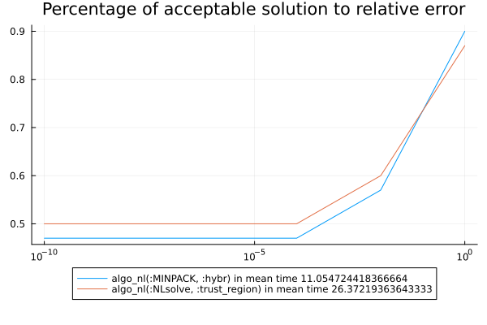

# Benchmarks for bench_hard.jl

```julia
using Pkg
using CTProblems
using MINPACK
using NLsolve
using BenchmarkTools
using CTFlows
using MLStyle
using MacroTools
using LinearAlgebra
using Plots
using CTBase
using ProgressBars
using NonlinearSolve
using Sundials
using DataFrames
using CSV
using PrettyTables
using ForwardDiff
include("bench_problems.jl")
include("bench_algo.jl")
algos = [algo_nl(:MINPACK, :hybr), algo_nl(:NLsolve, :trust_region)]
problem_list_hard = [OCPProblem{(:orbital_transfert, :energy, :x_dim_4, :u_dim_2, :lagrange)}(); OCPProblem{(:orbital_transfert, :consumption, :x_dim_4, :u_dim_2, :lagrange, :u_cons)}(); OCPProblem{(:orbital_transfert, :time, :x_dim_4, :u_dim_2, :mayer, :u_cons)}()]
ξ_list_hard = Dict((pb => generate_variation(pb.sol, 0.05, 10) for pb = problem_list_hard))
(rates_tol_hard, times_hard, df_rate_hard) = compute_rate(algos, problem_list_hard, ξ_list_hard)
plot([10.0 ^ -i for i = 10:-2:0], [rates_tol_hard[key] for key = collect(keys(rates_tol_hard))], label = reshape([shorten_label(string(key)) * " in mean time " * string((times_hard[key])[1]) for key = collect(keys(rates_tol_hard))], 1, size(algos, 1)))
plot!(xscale = :log10, yscale = :linear, title = "Percentage of acceptable solution to relative error")
plot!(legend = :outerbottom)
savefig("build/bench_hard.svg")
```
  
 ```julia 
CSV.write("build/df_rate_algo_hard.csv", df_rate_hard)
h1 = Highlighter(((df_rate_hard, i, j)->begin
                j in [2, 3, 4, 5] && df_rate_hard[i, j] == minimum(df_rate_hard[:, j])
            end), bold = true, foreground = :red)
h2 = Highlighter(((df_rate_hard, i, j)->begin
                j in [2, 3, 4, 5] && df_rate_hard[i, j] == maximum(df_rate_hard[:, j])
            end), bold = true, foreground = :green)
pretty_table(String, df_rate_hard; tf = tf_markdown, alignment = :c, header = ["name"; [shorten_label(string(algo)) for algo = algos]], highlighters = (h1, h2))
```

|                           name                           | algo_nl(:MINPACK, :hybr) | algo_nl(:NLsolve, :trust_region) |
|----------------------------------------------------------|--------------------------|----------------------------------|
| Orbital transfert - energy minimisation - min ∫ ‖u‖² dt  |           0.8            |               0.8                |
| Orbital transfert - consumption minimisation - ∫ ‖u‖ dt  |           0.4            |               0.7                |
|          Orbital transfert - time minimisation           |           0.5            |               0.3                |
|                           mean                           |         0.566667         |               0.6                |


