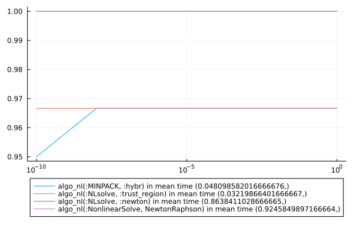

# Benchmarks for src/bench_all.jl

```julia
using Pkg
using CTProblems
using MINPACK
using NLsolve
using BenchmarkTools
using CTFlows
using MLStyle
using MacroTools
using LinearAlgebra
using Plots
using CTBase
using ProgressBars
using NonlinearSolve
using Sundials
include("bench_problems.jl")
include("bench_algo.jl")
algos = [algo_nl(:MINPACK, :hybr), algo_nl(:NLsolve, :newton), algo_nl(:NLsolve, :trust_region), algo_nl(:NonlinearSolve, NewtonRaphson())]
problem_list = [OCPProblem{(:exponential, :energy, :state_dim_1, :control_dim_1, :lagrange)}(); OCPProblem{(:exponential, :time, :state_dim_1, :control_dim_1, :lagrange)}(); OCPProblem{(:integrator, :energy, :free_final_time, :state_dim_1, :control_dim_1, :lagrange)}(); OCPProblem{(:turnpike, :integrator, :state_energy, :state_dim_1, :control_dim_1, :lagrange, :control_constraint, :singular_arc)}(); OCPProblem{(:integrator, :energy, :state_dim_2, :control_dim_1, :lagrange)}(); OCPProblem{(:integrator, :energy, :distance, :state_dim_2, :control_dim_1, :bolza)}()]
ξ_list = Dict((pb => generate_variation(pb.sol, 3, 10) for pb = problem_list))
function compute_rate()
    rate = Dict()
    time_elapsed = Dict()
    for algo = algos
        println("Using algo : ", algo)
        success = [0 for i = 0:2:10]
        time = 0
        for pb = problem_list
            println("           with problem : ", pb.title)
            iter = ProgressBar(1:size((collect(values(ξ_list)))[1], 1))
            for i = iter
                ξ_guess = (ξ_list[pb])[i]
                time += @elapsed(res = solve_generic(pb.shoot, ξ_guess, algo.package, algo.name))
                E_rel = (norm(res.x) - norm(pb.sol)) / norm(pb.sol)
                success = success + [E_rel ≤ 10.0 ^ -i for i = 10:-2:0]
            end
        end
        nb_it = size(problem_list) .* size((collect(values(ξ_list)))[1], 1)
        rate[algo] = success ./ nb_it
        time_elapsed[algo] = time ./ nb_it
    end
    return (rate, time_elapsed)
end
function shorten_label(lab::String)
    if lab == "algo_nl(:NonlinearSolve, NewtonRaphson{0, true, Val{:forward}, Nothing, typeof(NonlinearSolve.DEFAULT_PRECS), true, nothing}(nothing, NonlinearSolve.DEFAULT_PRECS))"
        return "algo_nl(:NonlinearSolve, NewtonRaphson)"
    else
        return lab
    end
end
(rates, times) = compute_rate()
println([string(key) for key = collect(keys(rates))])
plot([10.0 ^ -i for i = 10:-2:0], [rates[key] for key = collect(keys(rates))], label = reshape([shorten_label(string(key)) * " in mean time " * string(times[key]) for key = collect(keys(rates))], 1, size(algos, 1)))
plot!(xscale = :log10, yscale = :linear)
plot!(legend = :outerbottom)
savefig("src/bench_all.svg")
```
 